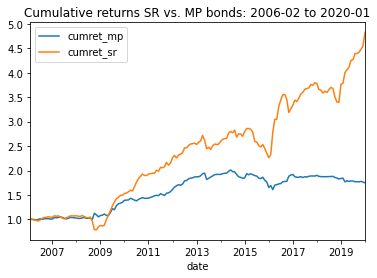
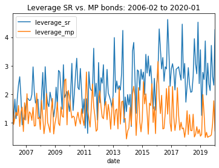
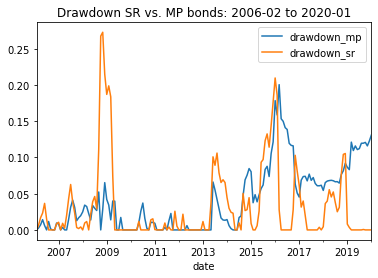
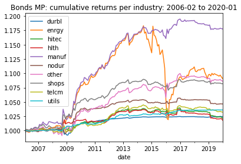
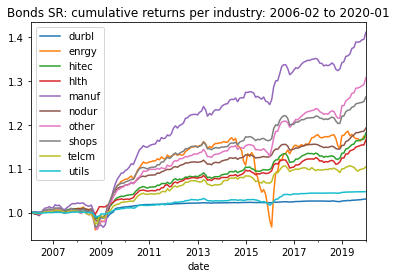
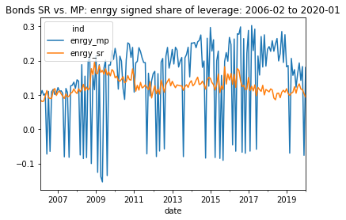
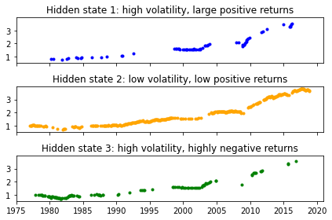
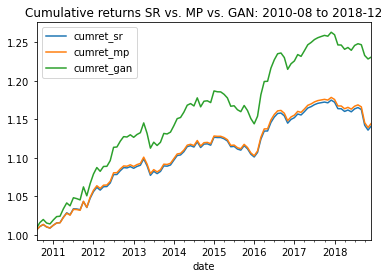
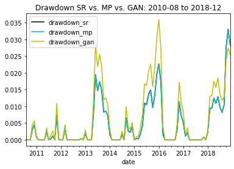

# Deep Learning for Corporate Bonds 

If want to see just how to run the code go to [Code organization](#codeorga) section, and afterwards to section [How to run](#run).

## 1. Project description

We use neural networks to estimate an asset pricing model of the U.S. corporate bonds market from February 1973 to January 2020. We use two distinct estimation approaches: (1) minimize the mispricing loss, and (2) maximize the Sharpe ratio. Weights for the resulting bond-portfolio are functions of a large set of predictive features comprising macro time series, individual bond characteristics, as well as many equity/bond-issuer fundamental characteristics.
We focus on the distinctions between these two approaches, which under the lens of the classical theory of finance (Efficient Market Hypothesis) should be small. We also comment on other ML estimation approaches used in the literature. Finally, to complement the insights from the neural networks exercise, we estimate ex-post, and without data produced from our model, the market regimes in the U.S. corporate bond market.

### 1.1 The main mathematical relations of asset pricing

Note: Many academic books contain a detailed and more formal exposition of the following facts. See e.g. chapters 3 and 5 in [Back](https://global.oup.com/academic/product/asset-pricing-and-portfolio-choice-theory-9780190241148?lang=en&cc=us). 

An asset pricing model is based on the **no arbitrage** logic of capital markets: prices of distinct assets tend to evolve in such a way that opportunities to make easy profits by buying and selling disappear quickly. 

For an asset universe indexed by $i\in \{1,\dots,N\}$ it can be shown that the no arbitrage condition implies the existence of a random variable $\{M_t\}_t$ called the **stochastic discount factor**, such that the excess-returns time series $R_{t}^e = (R_{t,i}^e)_i$ (in vector notation) satisfies
$$
(1)\qquad\mathbb{E}_t[M_{t+1}R_{t+1}^e] = 0.
$$
Here $\mathbb E_t$ is the expectation operator w.r.t. information known at time $t$. One can think of $M_{t}$ as modeling the marginal utility of an investment in various assets at time $t$. Then the no arbitrage condition says that the *expected marginal utility* coming from the excess return from investing in various assets should be equal across assets in the market, as well as equal to zero. This is an agent optimality condition towards which the market is supposed to tend over time. Given the conditional expectation formulation in (1), one can express the one-step ahead stochastic discount factor $M_{t+1}$ also through the return of a portfolio with weights $\omega_t$, called the *SDF-portfolio*. 

It can be shown that in a frictionless and complete financial market, which satisfies the assumptions of the Efficient Market Hypothesis (EHM):
$$
(2)\qquad M_{t+1} = 1-\omega_t \cdot R_{t+1}^e, 
$$
where $\omega_t$ are the portfolio weights **that maximize the Sharpe ratio in the asset universe**. 
Suppose one uses either of the relations (1) or (2) to estimate the return of the SDF-portfolio given by $$F_{t+1} = \omega_t \cdot R_{t+1}^e.$$ Simple algebra leads to the following estimate for the future return of an asset. 
$$
(3)\qquad \mathbb E_t[R_{t+1}^e] = \left(\frac{Cov_t(F_{t+1},R_{t+1}^e)}{Var_t[F_{t+1}]}\right)\cdot \frac{Var_t[F_{t+1}]}{E_t[F_{t+1}]} =: \beta_{t} \cdot\lambda_t.
$$
This is the prediction of the one-step ahead excess return of an asset based on a single risk factor and with time-dependent loading on the single risk factor.
$\lambda_t$ is a measure of the systematic risk in the market, whereas $\beta_t$ a vector of exposures of the assets in the market to these risks. One can use statistical properties of the estimate of the return of the SDF-portfolio $F_t$ to assess the performance of a strategy which is rewarded for taking up the systematic risk in the market. Below we consider **Sharpe ratio, Sortino ratio, Calmar ratio, CAGR**, but also **drawdown** and **leverage** to characterize the performance of the SDF-portfolio. 

If one has an estimate of the return of the SDF-portfolio $\hat{F_t}$, this leads to estimates of the excess return vector $\hat R^e_{t+1}$, via estimates of the common risk factor $\hat\lambda_t$, and risk exposures $\hat\beta_t$. One can show that the betas are up to a scaling factor equal to $\mathbb E_t[F_{t+1}\cdot R_{t+1}]$. Hence one can estimate the betas by estimating the conditional expectation $\mathbb E_t[F_{t+1}\cdot R_{t+1}]$.

This in turn can be used, by interpreting (3) as a regression equation, to calculate the residual unexplained by the risk factor. One arrives at the characterization of the pricing error 
$$
(4)\qquad \hat\epsilon_{t+1} = R_{t+1}^e -\hat R_{t+1}^e = \left(\textbf{Id}-\hat\beta_t(\hat\beta_t^T\hat\beta_t)^{-1}\hat\beta_t^T\right)R_{t+1}^e.
$$
This residual can be used to assess the variance explainability of the factor model. 

### 1.2 Modeling

Our asset universe consists of a large cross section of corporate bonds in the U.S. market from February 1973 to January 2020. Such a wide cross section of assets is inherently imbalanced: bonds of the same issuer differ in maturity so that over time the universe of assets available for portfolio construction changes. This natural imbalancedness needs to be taken into account carefully in the coding of the ML procedures, so that we do not introduce inadvertently any look-ahead bias in the estimation. In addition to the imbalanced bond-level dataset, we also estimate the SDF based on a smaller balanced dataset of 40 portfolios that sort the bond-level data according to various bond characteristics.

In the decomposition $F_{t+1} = \omega_t \cdot R_{t+1}^e$ we model the portfolio weights as feed-forward neural networks of feature sets available at time $t$. In detail, we consider the following feature sets:

1. Full estimation: features to estimate the weight of an asset $\omega_{t,i}$ include the macro time series, the bond characteristics and the equity/firm characteristics of the issuer of the bond. See the section on **Data** for a more detailed description of the data.
2. Estimation without macro: only the bond characteristics and the equity/firm characteristics.

For robustness, we also consider versions of the full estimation procedure 1., where we leave out financials and REITs from the dataset.[^1]

[^1]: Jetlir Duraj thanks Rinald Murataj for suggesting this robustness exercise. 

#### Approach 1 for estimating $F_t$: minimize mispricing loss (MP-min)

Equation (1) can be used to estimate $F_{t+1}$ via the decomposition $M_{t+1} = 1-\omega_t \cdot R_{t+1}^e$, using as loss the $L^2$-deviation from (1). This leads to the following statistical loss, where the periods available are from $1$ to $T$: 

$$
\textrm{(5) Mispricing loss: }\qquad 
    \frac{1}{N}\sum_{i=1}^N\frac{|T_i|}{T} \left\lVert\frac{1}{|T_i|}\sum_{t\in T_i}\left(1-F_{t+1}\right) R_{t+1,i}^e\right\rVert^2,
$$
where $T_i$ is the set of dates for which asset $i$ is available. 

#### Approach 2 for estimating $F_t$: maximize Sharpe ratio (SR-max)

Alternatively, one can try to choose weights $\omega_t$ with the aim of maximizing the Sharpe ratio. This would lead to the following empirical maximization objective.

$$
\textrm{(6) Sharpe ratio: }\qquad \frac{mean((F_{t})_t)}{stdev((F_{t})_t)}.
$$

Because we use stochastic gradient descent-types of algorithms for the optimization, this objective is not numerically adequate during the training phase of the ML algorithms. Namely, the SGD-type algorithms will try to minimize empirically the denominator of the expression leading thus to very high Sharpe ratios in the train set but which do not generalize in the test set. We use instead a linearized version of the Sharpe ratio for training purposes:

$$
\textrm{(7) Linearized Sharpe ratio: }\qquad mean((F_t)_t)-\gamma\cdot stdev((F_{t})_t).
$$
Here $\gamma$ can be interpreted as a risk aversion parameter. We keep the original formulation of Sharpe ratio for model validation, and hyperparameter selection. 

For a fixed feature set, the optimization problem to solve becomes then
$$
min_{\omega_t\in NN, F_{t+1}=\omega_t\cdot R_{t+1}^e}\quad Loss((\omega_t\cdot R_{t+1}^e)_t),
$$
where Loss in Approach 1 is given by (5), and loss in Approach 2 is given by (7) during training and (6) during validation and testing. 
 
We compare these two approaches thoroughly in the **Results** section. The degree of deviation between the two can be interpreted as a measure of the inefficiency in the U.S. corporate bonds market.  

#### On modeling leverage

The weights produced from the neural networks do not generalize well without an additional normalization. We normalize them on the batch level using an Euclidean norm. As a last step before calculating the loss, one can normalize the weights $\omega_t$ through their $L^2$ or $L^1$ norm, multiplied with a constant that models a leverage bound. Note that the $L^1$ norm of the $\omega_t$-s can be interpreted as the leverage of the portfolio. Normalizing w.r.t. $L^2$ and $L^1$ leads to different final portfolios:

- $L^1$ normalization focuses weights in a few assets and makes the rest of the weights comparatively small. This may diminish the diversification effects of the portfolio, but also lower trading costs, in case of convex costs, because only a few assets are traded at a time.
- $L^2$ normalization produces a more evenly distributed portfolio, where most of the weights are bounded away from zero. This may strengthen the diversification effects, but also leads to higher trading costs.

We opted for the $L^2$ normalization since we do not model trading costs. In contrast to a bound on the $L^1$ norm, $L^2$ normalization allows some room for the algorithm to pick the 'right' leverage in a time-varying manner. A $L^2$-bound on weights is tantamount to a weak bound on leverage. Namely, for a batch size $n$, the norm inequalities say
$$
\lVert\omega_t\rVert_1 \leq \sqrt{n}\lVert\omega_t\rVert_2,
$$
so that a bound $C$ on $L^2$-norm of the weights can translate to a varying amount of leverage of the SDF portfolio on the date level, depending on how many dates are present in the batch. Heuristically, if the typical date contains $m$ assets, the number of dates in the batch is $\approx \frac{n}{m}$. This leads to a heuristic upper bound on date-level leverage for a batch of size $n$ of 
$$
\frac{C\cdot m}{\sqrt{n}}.
$$

#### On predictability.

Our data are monthly, which are notoriously low on predictability, as market forces typically have had enough time to exploit it. Moreover, the bond-level data is highly imbalanced. Hence, to assess predictability of the asset pricing model, we use aggregate measures of predictability, the aggregated ones used in [Chen, Pelger, Zhu 2021](https://pubsonline.informs.org/doi/abs/10.1287/mnsc.2023.4695):
$$
\textrm{(explained variation)}\quad EV = 1-\frac{\frac{1}{T}\sum_{t=1}^T \textrm{cross-sec-mean}(\epsilon_t^2)}{\frac{1}{T}\sum_{t=1}^T \textrm{cross-sec-mean}((R_t^e)^2)},$$

$$\textrm{(average mispricing error)}\quad \textrm{XS-R}^2 =  1-\frac{\frac{1}{N} \sum_{i=1}^N \frac{T_i}{T}\left(\textrm{t-series-mean}(\epsilon_i)\right)^2}{\frac{1}{N} \sum_{i=1}^N \frac{T_i}{T}\left(\textrm{t-series-mean}(R_i)\right)^2}.
$$
$EV$ is the $R^2$ of a cross-sectional regression on the loadings. The XS-$R^2$ is the average pricing error over time, divided by the average return over time.


## 2. Data

Note: the dataset used in this study has been constructed by Oliver Giesecke. 

### Individual bonds data

We use a cross section of 10,715 bond securities coming from 1,922 different issuers, covering the period February 1973 to January 2020. 

The features we use to estimate SDF-portfolio weights based on bond-level data can be split into 3 groups:

- Equity/firm individual characteristics: 
  - 41 distinct variables coming from the crosswalk between Compustat and CRSP in [WRDS](https://wrds-www.wharton.upenn.edu)
  - 10 industry dummies
- Bond characteristics: 9 variables
- Macro time series:
  - 126 time series coming from [FRED](https://research.stlouisfed.org/econ/mccracken/fred-databases/)
  - 10 forward spreads of the treasury yield curve
  - 41 medians of the 41 equity/firm individual characteristics
  - 6 other macro variables that have been shown to predict the equity risk premium, from [Goyal-Welch](https://academic.oup.com/rfs/article-abstract/21/4/1455/1565737)


### EJN bond portfolios

We use 40 bond portfolios first constructed in [Elkamhi, Jo, Nozawa 2023](https://papers.ssrn.com/sol3/papers.cfm?abstract_id=3669068).
These sort a similar universe of bonds to ours for the period October 1978 to December 2018. The portfolios are sorted according to the following characteristics: 
  - credit spreads 
  - intermediary capital exposure
  - credit rating
  - downside risk
  - maturity
  - idiosyncratic volatility.

As features to estimate SDF-portfolio weights based on the EJN portfolios we use the same macro features as for bond-level data and replace the equity/firm and bond characteristics with 9 individual characteristics based on EJN portfolio return data. These model common signals based on reversal, momentum and volatility.

## 3. ML estimation procedure

To avoid introducing look-ahead bias in the training in any form, and to keep the training fast and with comparably few GPU resources, we augment the feature set using a simple **double index** trick. Namely, we add to the usual individual+macro features of an asset in a specific time period, two index columns as features *(t_index, date_id)* that jointly identify an asset across time (*t_index* stands for total index). When a batch of data is furnished to the algorithm, it first splits the batch according to the dates available in the batch and then processes them accordingly. This avoids any type of look ahead bias by giving the algorithm only the minimal information it needs to calculate the weights and the loss of the batch. For a similar type of exercise, an alternative procedure is undertaken in [Chen, Pelger, Zhu 2021](https://papers.ssrn.com/sol3/papers.cfm?abstract_id=3350138). We comment on their estimation procedures in the last section.


#### Architectures for the weights network and for the beta networks:
Feed-forward networks with the following possible hidden unit sequences:

- Model 1: hidden units = [64,32,16,8]   (shallow FFN)
- Model 2: hidden units = [64,64,32,32,16,16,8,8]  (deep FFN)
- Model 3: hidden units = [64,64,64,32,32,32,16,16,16,8,8,8,4]   (deeper FFN)
- Model 4: hidden units = [1] (ENet, since we also include $L^1, L^2$ regularization of weights in the hyperparameters) 

All of the architectures win some of the time, so none is redundant.

#### Training and validation losses:

- for the SDF estimation:
  - mispricing loss approach: mispricing loss (5) for training phase, Sharpe ratio (6) for validation phase
  - maximize Sharpe ratio approach: minus linearized Sharpe ratio (7) for training phase, Sharpe ratio (6) for validation phase
  
  The training for the SDF estimation is end-to-end: the features are processed for each date separately to produce portfolio weights and the batch-loss is calculated via equation (5) or (7) depending on whether the approach is MP-min or SR-max. The loss is backpropagated to the SDF-network to update its parameters. 
- for the beta-network estimation:
  - MSE loss throughout
  
  Here we first create the labels $F_{t+1}\cdot R_{t+1}$ using the output $(F_{t+1})_{t+1}$ of the SDF estimation and then train a network to predict these labels, estimating thus $\mathbb E_t[F_{t+1}\cdot R_{t+1}]$. We use as predictive features the same features as the ones used in the SDF estimation to calculate the portfolio weights $\omega_t$.

#### Fixed hyperparameters, choices for a fixed architecture:

- [SiLU](https://paperswithcode.com/method/silu) activation for the FFNs
- test set is always 30% of the dates, validation is 28% of dates, train set 42% of dates
- momentum for Adam optimizer: 0.9
- 50 epochs training, early stopping after 8 epochs if Sharpe ratio has not improved
- we standardize features before feeding them to NN
- dropout regularization: 0.01 throughout
- we use batch-normalization layers except in the case of Model 4 (ENet)
- regularization based on leverage: $L^2$-normalization of weights in a batch with 
  - bound = 1 in case of EJN portfolios. 
  - bound = 0.1 in case of bond-level data. 
This allows for somewhat higher leverage in the case of bond-level data, to glean more out of diversification effects of the large cross section.
      
#### Hyperparameters we loop over for a fixed architecture

- batch sizes: [128, 256, 512, 1024, 2048]
- learning rates for Adam optimizer: [0.0001, 0.001, 0.005]
- $L^1$ regularization: ["none", 0.001, 0.01, 0.1]
- $L^2$ regularization: ["none", 0.001, 0.01, 0.1]

## 4. Results{#results}

Winning hyperparameters for every estimation can be found in the appendix to the [paper](https://drive.google.com/file/d/1bjoZ1UWcAT0L4ePAecm2yIl7ba9Id9aQ/view?usp=sharing). All results below are reported for the respective test set. 

All portfolio performance measures, are **monthly** values. All values are in decimal format, rounded up to 2 decimals, except for the alphas which are rounded up to 3 decimals.

### 4.1 Results for individual bonds data

SDF portfolio performance on test set. *Max lev* stands for maximum leverage, *mean lev* for mean leverage.

| Dataset | Objective  |  Sharpe| Sortino |Calmar| Max drawdown| Max lev | Mean lev|
|---|---|---|--|--|--|--|--|
| full feature set | MP |  0.17 | 6.30 | 0.02 | 0.20 | 3.15 | 1.29 |
| full feature set | SR |  0.27 | 3.93 | 0.03 | 0.27 | 4.62 | 2.42 |
| no macro | MP |  0.12 | 0.46 | 0.02 | 0.56 | 4.66 | 3.51 |
| no macro | SR |  0.29 | 2.54 | 0.05 | 0.29 | 4.29 | 2.58 |
| no fins+REITs | MP | 0.25  | 2.83 | 0.03 | 0.28 | 2.70 | 2.19 |
| no fins+REITs | SR | 0.26  | 2.02 | 0.03 | 0.39 | 3.97 | 3.20 |

Predictability results

| Dataset | Objective | EV  | XS-$R^2$ |
|---|---|---|--|
| full feature set | MP | 0.23  | 0.45 |
| full feature set | SR |  0.19 | 0.39 |
| no macro | MP |  0.20 | 0.27 |
| no macro | SR | 0.12  | 0.18 |
| no fins+REITs | MP | 0.22  | 0.36 |
| no fins+REITs | SR |  0.16 | 0.30 |

Monthly alpha results vs. common risk factors

|  Dataset | Objective | alpha vs. SPY  | p-val vs. SPY  |  alpha vs. FF3 |  p-val vs. FF3 |  alpha vs. FF5 |  p-val vs. FF5 |
|---|---|---|---|---|---|---|---|
| full feature set | MP |  0.003 | 0.06 | 0.003  |  0.06 | 0.003  |  0.07 |
| full feature set | SR  |  0.007 | 0.01 | 0.006  |  0.02 |  0.006 |  0.02 |
| no macro | MP |  0.001 | 0.86 |  0.002 |  0.60 |  0.002 |  0.64 |
| no macro | SR | 0.010 | 0.002 |  0.008 |  0.01 | 0.009  |  0.01 |
| no fins+REITs | MP |  0.005 | 0.02 | 0.005  |  0.04 | 0.005  |  0.06 |
| no fins+REITs | SR | 0.008 | 0.01 |  0.007 | 0.03  |  0.007 | 0.05  |

Monthly alpha results vs. EJN portfolios

|  Dataset | Objective | alpha vs. EJN ports  | p-val vs. EJN ports  |
|---|---|---|---|
| full feature set | MP  | 0.001  | 0.70 |
| full feature set | SR  | 0.001  | 0.32 |
| no macro | MP | -0.001  | 0.48 |
| no macro | SR | 0.003 | 0.001 |
| no fins+REITs | MP | +0.000 | 0.48 |
| no fins+REITs | SR | 0.001 | 0.48 |

### 4.2 Results for EJN portfolio data

SDF portfolio performance on test set. *Max lev* stands for maximum leverage, *mean lev* for mean leverage.

| Dataset | Objective  |  Sharpe | Sortino | Calmar | Max drawdown| Max lev| Mean lev|
|---|---|---|---|---|---|---|---|
| full feature set | MP |  0.25 | 14.09 | 0.03 | 0.06 | 1.15 | 0.44 |
| full feature set | SR |  0.24 | 12.28 | 0.03 | 0.07 | 1.14 | 0.44 |
| no macro | MP |  0.22 | 5.01 | 0.03 | 0.17 | 2.70 | 0.99 |
| no macro | SR |  0.22 | 12.04 | 0.03 | 0.09 | 1.23 | 0.56 |

Predictability results.

| Dataset | Objective | EV | XS-$R^2$ |
|---|---|---|---|
| full feature set | MP | 0.64  | 0.88 |
| full feature set | SR |  0.70 | 0.92 |
| no macro | MP |  0.40 | 0.71 |
| no macro | SR | 0.65  | 0.88 |

Monthly alpha results

|  Dataset | Objective | alpha vs. SPY  | p-val vs. SPY  |  alpha vs. FF3 |  p-val vs. FF3 |  alpha vs. FF5 |  p-val vs. FF5 |
|---|---|---|---|---|---|---|---|
| full feature set | MP  |  0.001 |  0.03 | 0.001  |  0.04 | 0.001 |  0.07 |
| full feature set | SR  |  0.001 |  0.04 | 0.001  |  0.06 |  0.001 |  0.09 |
| no macro | MP |  0.003 | 0.06 |  0.003 |  0.08 |  0.002 |  0.12 |
| no macro | SR | 0.002 | 0.06 |  0.001 | 0.07  | 0.001  |  0.10 |

### 4.3 Summary of results from the neural networks exercise

#### Individual bonds data

We summarize the insights for bond-level data:

1. Approach (2) - SR-max, performs relatively better than Approach (1) - MP-min in terms of portfolio ratios and excess returns: it achieves better Sharpe and Calmar ratio on test set as well as higher CAGR, together with higher and more significant alphas. It also takes on more leverage in the case of the full feature set. 
2. Leaving out macro time series as features leads to higher leverage and higher drawdown. It also lowers predictability.
3. SR-max without macro features achieves the highest Sharpe ratio and Calmar ratios than any other model, but at the cost of lower Sortino ratio and somewhat higher drawdown, together with higher mean leverage than the version incorporating macro features.
4. The discrepancy between SR-max and MP-loss becomes smaller when leaving out financials+REITs. 
5. SR-max is always faster to train than MP-min. The discrepancy is larger for bond-level data than for EJN portfolios. 







To exemplify the difference between the two approaches, SR-max and MP-min, we calculate the split of the SDF portfolio return across industries in the test set. The following graphs depict the cumulative returns split according to industries.





We see a different evolution of the index of **energy** (enrgy). Both SR-max and MP-min investment in the energy sector sustain losses in 2015 and early 2016, but under MP-min a greater degree of the cumulative returns had come from the energy sector in the preceding years. Hence it never recovers afterwards to the previous levels. The SR-max investment in the energy sector does recover near the end of the test set. 

To see how the total weight on the energy sector evolves under the two approaches, we calculate the signed leverage share of the energy sector: for each date $sign(sum(\textrm{weights of energy}))\times\frac{sum(abs(\textrm{weights of energy}))}{\textrm{total leverage}}$.



We see that this statistic is much smoother for SR-max, it never crosses in negative territory and remains relatively stable over time. For several industries, though not all, we see a similar distinction in the evolution of their share in the overall portfolio leverage between SR-max and MP-min. 

#### EJN bond portfolios

For the EJN portfolios, the differences between SR-max and MP-loss are smaller. Leaving out macro features lowers the significance of alphas for both approaches.

Finally, we see that there is no significant alpha of the bond-level SDF portfolio when compared to the EJN portfolios. This indicates that a simpler strategy based on the EJN portfolios as factors, may be a computationally cheaper way to achieve high Sharpe ratios and alphas in the bond-market than a strategy that tries to construct a portfolio out of the full bond universe.

### 4.3 Ex-post market analysis: market regimes in the US corporate bond market

We run a Gaussian HMM with two and three states on the 40 EJN portfolios. This is in-sample estimation, performed with data that our model does not produce. The purpose is to gain some insights on the bond market over the years with a simpler approach, and decoupled from our neural networks exercise. The HMM model with three states delivers states with clear interpretation:

- State 1: high volatility, high positive returns
- State 2: low volatility, low positive returns
- State 3: high volatility, negative returns

The evolution of the cumulative returns of the equally weighted index on bond portfolios over time is depicted below.



We see that, except for the 1980s, the low-volatility-small-positive-returns state dominates over time and this dominance continues in the test set of the neural networks exercise (from February 2006 to January 2020). 
## 5. Other

### 5.1. The GAN model of Chen, Pelger, Zhu (2021)

In a recent [paper](https://papers.ssrn.com/sol3/papers.cfm?abstract_id=3350138) (see also their [code](https://github.com/jasonzy121/Deep_Learning_Asset_Pricing)), Chen, Pelger and Zhu estimate the SDF portfolio for the U.S. stock market using as features individual stock characteristics as well as a large set of macro time series similar to ours. The GAN architecture they consider uses a more general version of the mispricing loss (5), that takes into account test assets. Namely, they consider the following generalized mispricing loss function 
$$
(8)\qquad 
    \min_{\omega_t \textrm{s.t.} F_{t+1}=\omega_t\cdot R_{t+1}^e}\max_{g_t}\quad\frac{1}{N}\sum_{i=1}^N\frac{|T_i|}{T} \left\lVert\frac{1}{|T_i|}\sum_{t\in |T_i|}\left(1-F_{t+1}\right) R_{t+1,i}^e\cdot g_{t,i}\right\rVert^2,
$$
where $T_i$ is the set of dates for which asset $i$ is available. $g_{t,i}$ are *test assets/portfolios*. These are portfolio returns that act as a critic to the construction of the weights $\omega_t$ in an adversarial way. The test assets $g_t$ are modeled as a neural network function of the same set of individual and aggregate characteristics as the weights $\omega_t$ (Moments Network). The weights themselves are produced from a separate neural network (SDF network). In both networks, the macro data are passed through a LSTM network, the individual characteristics through a FFN and the output of both through another FFN layer to produce the weights. Moreover, they feed the train, validation and test datasets each separately in one batch, hence the batch size is not used as a hyperparameter. Note that their stocks dataset is also inherently imbalanced over time as ours is. They deal with this imbalancedness by feeding the batch as a balanced dataset where the missing returns are replaced by a dummy value UNK.  

We have implemented a more online and more memory efficient version of their algorithm. In particular, our version of the GAN algorithm has the following differences:

- We can work with the batch size as a hyperparameter for the Adam optimizer. This is because of the double index trick mentioned in the **ML Estimation** section.
- We feed the dataset without bloating it through replacing missing assets with a dummy UNK value. 
- We allow for repetition of the steps 1-3 above, i.e. allow training with a variable number of global epochs. 
- We work with GRU cells as an RNN network for the macro time series instead of LSTM cells.
- Our code is in Pytorch, not Tensorflow.
- We feed to the RNN of choice (GRU cell) sequences of 12 months of macro data.

We have tried two architectures with the GAN model for SDF estimation. They are mainly distinguished by the FFN network used in the SDF network to merge the macro hidden states with the individual characteristics of the bonds, and whose output are the SDF portfolio weights. 
We search among the same hyperparameter space as in the case of the simpler architectures above, and split the dataset the same way as above: 42% train, 28% validation, and 30% test set.
Having in mind comparisons of GAN to SR-max and MP-min, we note that, because of the loss of 12 months of data due to the RNN processing sequences of macro data, the test set is now shorter than in the respective estimations of MP-min and SR-max above. Hence, the SR-max and MP-min models are tested on a larger time frame than the GAN network. 

With the caveat that we have not performed a more extensive architecture and hyperparameter search, we find that:

- for the bond-level data, we encounter to a large degree **mode collapse**, even in the model with the best hyperparameters. Mode collapse in our case manifests itself in the weights of the portfolio being equal to each other for each date, i.e. the SDF portfolio produced consists of going either long or short the equally weighted portfolio in the market. Obviously this is not a good approximation of the SDF. We hypothesise, without further investigation, that the mode collapse for the large dataset of bond-level data can be overcome by searching over a larger space of hyperparameters and architectures.
- for the EJN portfolio data, the winning model does not suffer from mode collapse. It achieves higher Sharpe, Sortino and Calmar ratios than the SR-max model above.  In terms of alphas vs. SPY, FF3, FF5, GAN achieves alphas of the same magnitude as SR-max, but with slightly lower significance. 
- training the GAN network on the same hardware as the previous approaches, is a multiple of times more expensive in terms of computation hours than simpler approach without test asset generation


SDF portfolio performance

| Dataset | Objective  |  Sharpe ratio | Sortino ratio |Calmar ratio| Max drawdown| Max lev| Mean lev|
|---|---|---|---|---|---|---|---|
| full feature set | GAN |  0.30 | 0.47 | 0.01 | 0.04 | 0.59 | 0.55 |

Monthly alphas w.r.t. standard risk factors

|  Dataset | Objective | alpha vs. SPY  | p-val vs. SPY  |  alpha vs. FF3 |  p-val vs. FF3 |  alpha vs. FF5 |  p-val vs. FF5 |
|---|---|---|---|---|---|---|---|
| full feature set | GAN  |  0.001 |  0.05 | 0.001  |  0.09 | 0.001 |  0.12 |
 
The following graphs depict cumulative excess returns and drawdown in the common test set for all three models we have estimated for EJN portfolios.
  
 

We have also tried the GAN network using industry stock portfolios from [Kenneth French's website](https://mba.tuck.dartmouth.edu/pages/faculty/ken.french/Data_Library/det_10_ind_port.html). Comparing to SR-max for the same asset universe, and same hyperparameters we find that the Sharpe ratio is higher, but now the Sortino and Calmar ratios are lower. Leverage is higher and the typical as well as maximal drawdown also higher. For this particular dataset we find no alpha w.r.t. FF3 and FF5 factors for neither the GAN network, nor the Sharpe ratio maximization approach.

## 4. Code organization{#codeorga}

The code for the neural networks SDF and beta estimation exercise is under src/NN. The code with example files for the preprocessing is under ```src/NN/PreprocessingFiles```. Finally, ```src/NN/SlurmScripts``` contains slurm scripts for running on a cluster.

The code for the GMM exercise is under ```src/GMM```. 

The code for the Gaussian HMM is under ```src/HMM``` (one file only). 

See the file requirements.txt for the packages under which code has been tested. Need to change paths as needed to run the scripts.

### 4.1 How to run{#run}

First create a conda environment with minimal requirements as in ```requirements.txt```. 

The slurm submission files for neural networks estimations of the SDF are similar, except for the change in the training script called. They are contained in ```src/SlurmScripts```. Change the file ```activate_env.sh``` under ```src/NN``` as needed. It is cluster-specific and loads the environment in each slurm script contained in ```src/NN/SlurmScripts```. 

Note: the beta net estimation allows in addition for data parallelism across multiple GPUs on one cluster node. This has been tested. We do not post a version of the SR-max, MP-min or GAN networks with data parallelism since they have not yet been tested.

- For the SDF estimation using SR-max, MP-min: 
  First run a respective preprocessing file producing the inputs for the neural networks exercise. Then, for the SDF estimation, change the job numbers and the project_name accordingly in the ```slurm_sdf_estimation.sh``` under ```src/SlurmScripts```. Then submit ```slurm_sdf_estimation.sh``` with the sbatch command:

      sbatch slurm_sdf_estimation.sh

  This slurm script uses the train script ```nolabels_one_shot.py```.
  In one fell swoop, it will run the whole hyperparameter and architecture loop, as well as find best model+hyperparameters and produce and save ensembling, together with its performance. 

- For the beta estimation, copy first the respective file of beta labels produced by the SDF estimation into the data folder used by the preprocessing file of the beta estimation. Then run the preprocessing file. Finally submit the slurm job via

      sbatch slurm_beta_estimation.sh

  with any necessary changes to project_name, job-number, save paths etc. Just as for the SDF estimation, this will run the grid search, as well as find best hyperparameters+architecture, and do the ensembling in one fell swoop. This uses the train script ```labels_one_shot.py``` that allows for data parallelism on one multi-gpu node.
- For the GAN network procedure: similar to case above, except now you submit the slurm file
      
      sbatch slurm_gan_estimation.sh

  This uses the train script ```one_shot_gan.py```.
- For the GMM exercise: run first ```GMM_bondpfs_preprocessing.py```. Determine there the number of PCA factors one wants to run by running ```bai_ng_analysis()```. Then change the respective ```nr_facs``` variable in ```preprocess_ejnports``` function to save the respective input dataframes for the GMM exercise. Finally, run ```GMM_bondpfs_main.py```. For the Diebold-Mariano test analysis of residuals between neural networks and predictive regressions, run ```GMM_vs_NN_residuals.py```. 

## References

Back, K. (2010) Asset Pricing and Portfolio Choice (Oxford University Press, Oxford, UK)

Elkamhi, R., Jo, C. and Nozawa, Y. (2023) A One-Factor Model of Corporate Bond Premia (forthcoming in Management Science)

Chen, L., Pelger, M. and Zhu, J. (2023) Deep Learning in Asset Pricing, [Management Science 2023](https://pubsonline.informs.org/doi/abs/10.1287/mnsc.2023.4695). [Code]()
